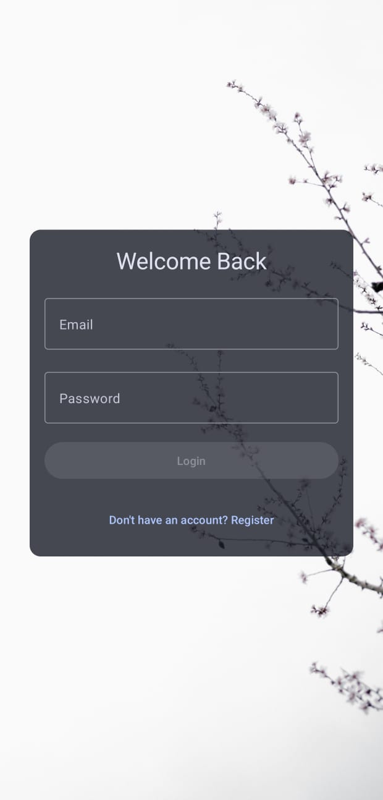
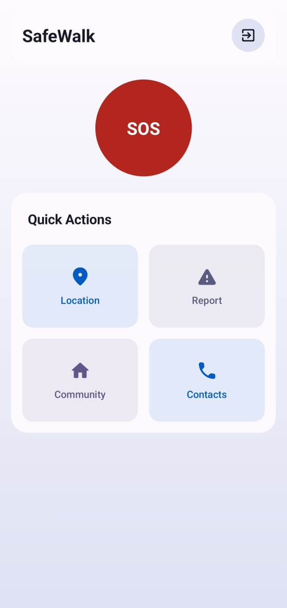

# SafeWalk 🚶‍♀️

**SafeWalk** is an Android application built using **Jetpack Compose**, designed to enhance women's safety. It provides user authentication, emergency contact management, location tracking, and an SOS alert system integrated with Firebase and Google Maps.

---

## ✨ Features

- 🔐 **User Authentication**  
  Sign up and log in with email/password using Firebase Authentication.

- 👨‍👩‍👧 **Emergency Contacts**  
  Add, view, and delete emergency contacts stored securely in Firebase Firestore.

- 🗺️ **Live Map Tracking**  
  View your current location using Google Maps with support for dynamic updates.

- 🚨 **SOS Alert System**  
  Send emergency alerts with a single tap to notify contacts in critical situations.

---

## 🖼️ Screenshots

| Auth Screen | Dashboard |
|------------|-----------|----------|
|  |  |

---

## 📦 Tech Stack

- **Kotlin + Jetpack Compose**
- **Firebase Authentication**
- **Cloud Firestore**
- **Google Maps (Maps SDK & Maps Compose)**
- **Navigation Compose**
- **Material 3 UI Components**

---

## 🛠️ Setup Instructions

1. **Clone the Repository**
   ```bash
   git clone https://github.com/isdevit/SafeWalk.git
   cd safewalk
   ```

2. **Configure Firebase**
   - Add your `google-services.json` file to the `/app` folder.
   - Create a file called `secrets.properties` in the root directory and add:
     ```
     MAPS_API_KEY=your_maps_api_key_here
     ```

3. **Build & Run**
   - Open in Android Studio
   - Run on a device or emulator

---

## 📁 APK Location

Once built, the APK can be found at:
```
app/build/outputs/apk/debug/app-debug.apk
```

Or for a release build:
```
app/build/outputs/apk/release/app-release.apk
```

---

## 🤝 Contributing

Contributions are welcome! Please fork the repo and create a pull request.

---

## 📄 License

This project is licensed under the MIT License - see the [LICENSE](LICENSE) file for details.

---

> Developed as part of a postgraduate academic project to support women's safety through technology.
